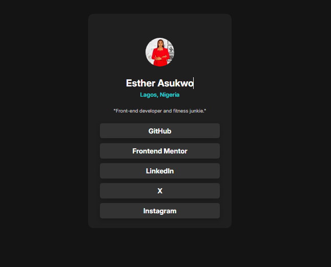

# Frontend Mentor - Social links profile solution

This is a solution to the [Social links profile challenge on Frontend Mentor](https://www.frontendmentor.io/challenges/social-links-profile-UG32l9m6dQ). Frontend Mentor challenges help you improve your coding skills by building realistic projects.

## Overview

- Solution URL: [Add solution URL here](https://github.com/obongg/Dev-and-I/)
- Live Site URL: [Add live site URL here](https://your-live-site-url.com)

### Screenshot

## My process

i started by writing the html and styling with css. I choose to design a personal profile and since the profile photo i used didnt align with the hover colors in the project, i picked a different color for that.

### Built with

- Semantic HTML5 markup
- CSS custom properties
- Flexbox

### What I learned

for the links,I had difficulty figuring out the parent or child container to add the width and height to. this i later figured out.
I was also able to make my work responsive.

### Continued development

I hope to work on more projects and improve my dev skills while at it.

## Author

- Website - [Add your name here](https://www.your-site.com)
- Frontend Mentor - [@yourusername](https://www.frontendmentor.io/profile/yourusername)
- Twitter - [@yourusername](https://www.twitter.com/yourusername)
